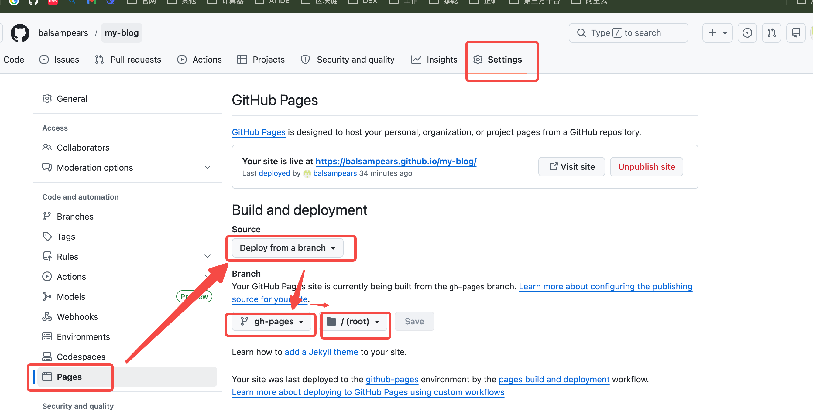
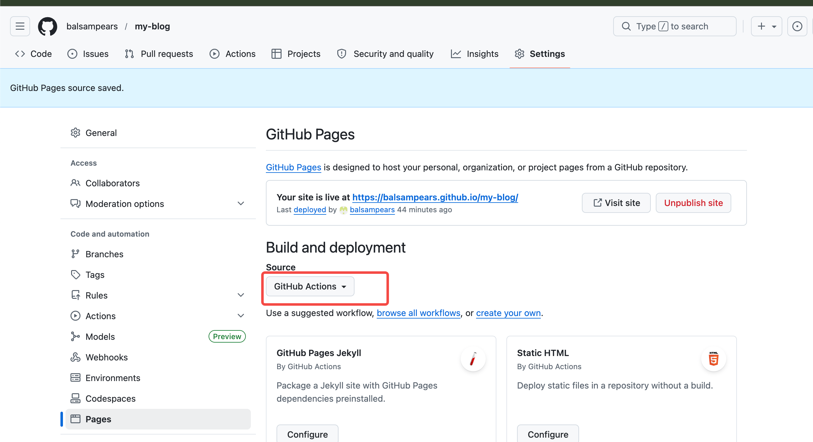

+++
date = '2026-04-09T21:00:00+08:00'
draft = false
title = '使用GithubPage发布博客'
slug = "hugo-githubPage-publish"
+++

## 一. Github仓库配置
### 1.发布代码到Github
这里大家都会，省略
### 2.设置Github Page

这样做的目的是指定github page使用什么分支的代码、什么目录下的代码。

## 二. 发布
### 1.发布前准备
修改 config/_default/hugo.toml中的baseURL，指定为：  
baseUrl = '[你的用户名].github.io/[Github仓库名]'

### 2.运行发布脚本
编写一个脚本，具体功能：
1.使用hugo --minify 生成public编译后的html
2.切换到public目录，切换gh-pages分支
3.将public目录下的代码发送到gh-pages分支上  

将下面脚本放在 scripts/deploy.sh，运行它（scripts/deploy.sh）  
参考: https://github.com/balsampears/my-blog/blob/master/templates/deploy.sh

### 3.访问
[你的用户名].github.io/[Github仓库名]  
注意：当发布到gh-pages时，可能需要1~5分钟才会刷新页面

### 4.使用Github Action发布（可选）
如果想监听分支提交，自动发布文档则可以使用Github Action
1. 重新设置Github Page

2. 编写工作流
创建 .github/workflows/hugo.yml。当监听到master代码提交时，触发一次hugo构建，并将public代码发布到gh-pages分支上  
参考: https://github.com/balsampears/my-blog/blob/master/templates/github_workflow_hugo.yml

检查Github Action观察是否构建成功
